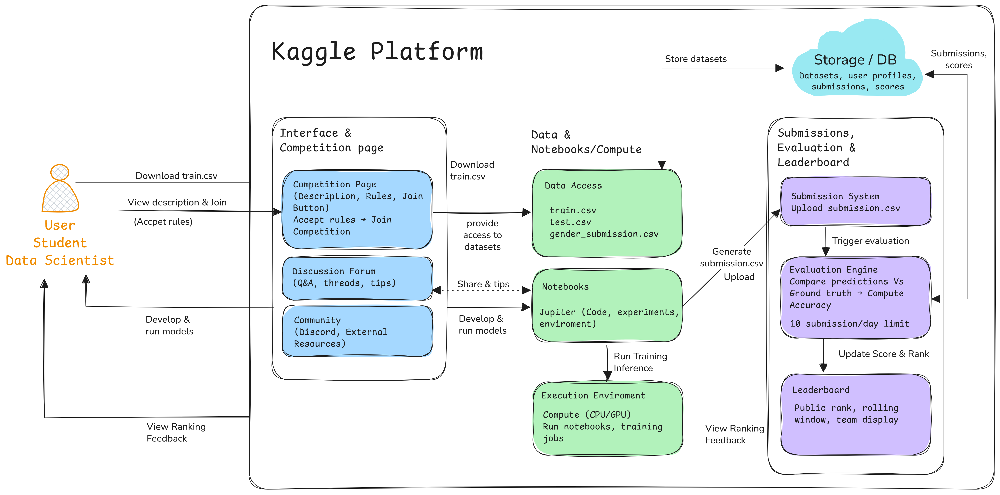

# Workshop 1 — Systems Engineering Analysis

---

## Overview

This workshop marks the **first stage** of the *System Analysis & Design Project*.  
Its purpose is to apply **systems engineering principles** to the Kaggle competition  
**“Titanic: Machine Learning from Disaster”**, analyzing the system as a dynamic structure of interacting elements affected by complexity, sensitivity, and chaos.

This phase builds the **conceptual foundation** for the following design and implementation stages.

---

## Objectives

- Perform a **systemic analysis** of the Titanic competition to identify its main components and relationships.  
- Evaluate **data dependencies**, **constraints**, and **inter-element sensitivity** affecting predictive performance.  
- Recognize **chaotic and nonlinear behaviors** within the dataset.  
- Create a **visual model** of the system architecture, representing how competition elements interact.  
- Generate an analytical report that supports the system design developed in Workshop 2.

---

## Files Included

| File | Description |
|------|-------------|
| **`Workshop.pdf`** | Final report document submitted for Workshop 1. |
| **`worksheet.tex`** | LaTeX source file used to compile the report. |
| **`Figure1.png`** | System architecture diagram for the Kaggle environment. |
| **`Workshop1.excalidraw`** | Editable version of the system diagram. |
| **`README.md`** | Overview and description of this workshop folder. |

---

## Key Insights

Through a systemic approach, the analysis revealed that the Titanic dataset behaves as a **complex adaptive system**, influenced by interdependent variables and unpredictable factors.  
Key findings include:

- High sensitivity to missing or incomplete data (Age, Cabin, Embarked).  
- Strong interactions among core features such as *Sex*, *Pclass*, and *Fare*.  
- Evidence of **nonlinear effects** and **feedback patterns** consistent with chaos theory.  
- Importance of structured data handling and modular analysis pipelines for reproducibility.

---

## Visual Component

Below is the system architecture diagram representing the Kaggle competition flow —  
from **data ingestion** and **model development** to **submission** and **evaluation**.

---

